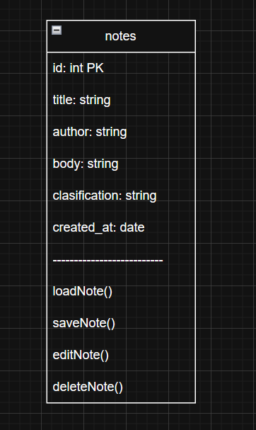
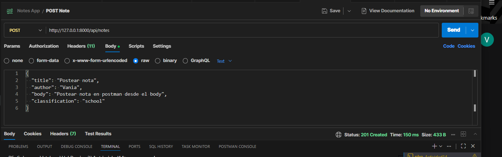
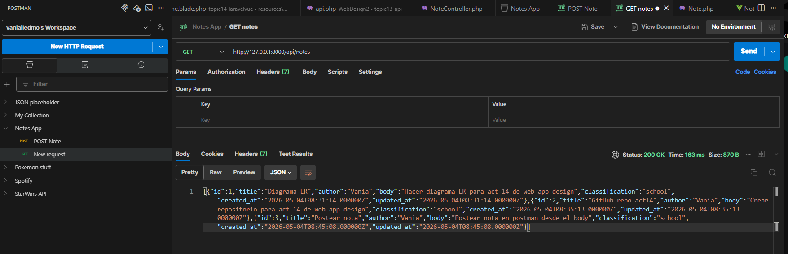
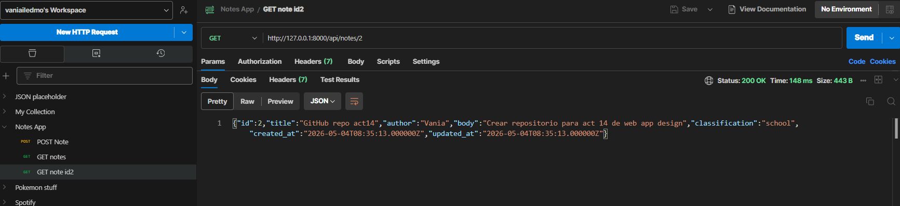
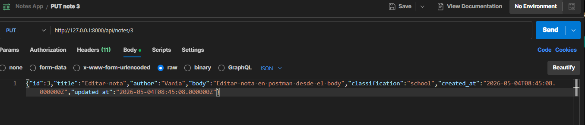
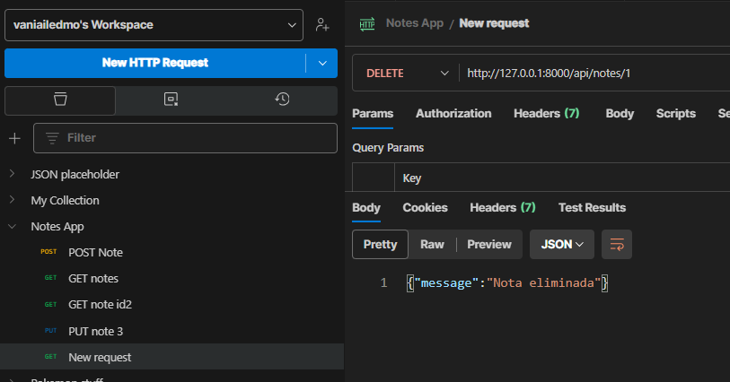

Activity 14
Simple REST API app that can perform CRUD operations, it can be used to store, consult and esit personal notes.

Postman screenshots for crud actions
Post note

Get all notes

Get a specific note

Edit a note

Delete a note

